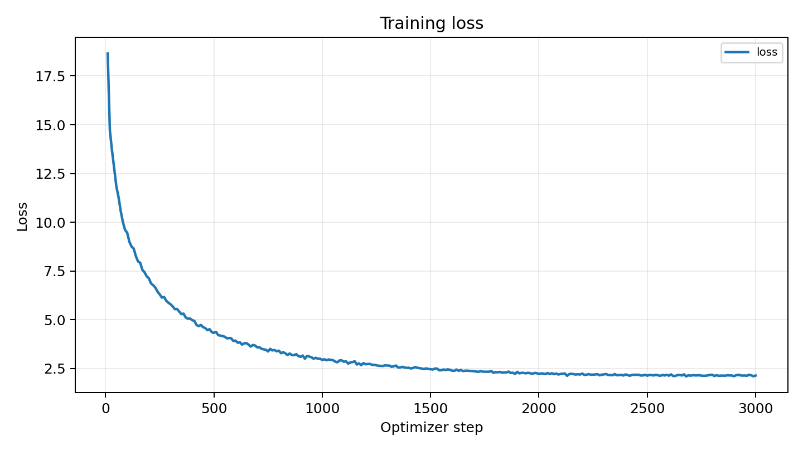
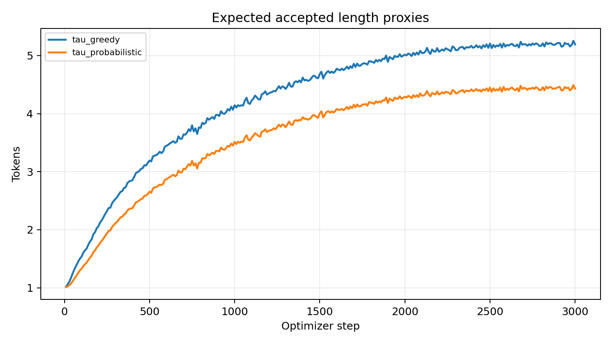
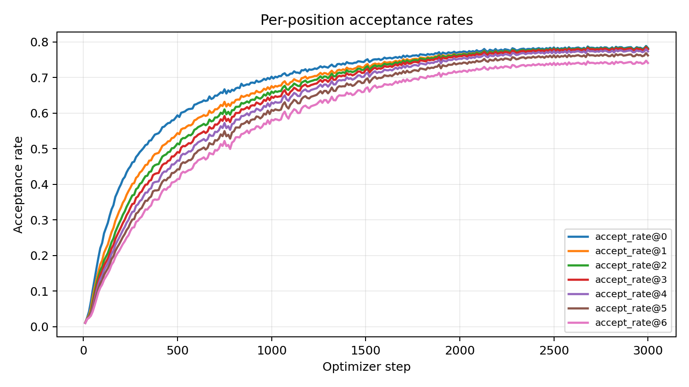
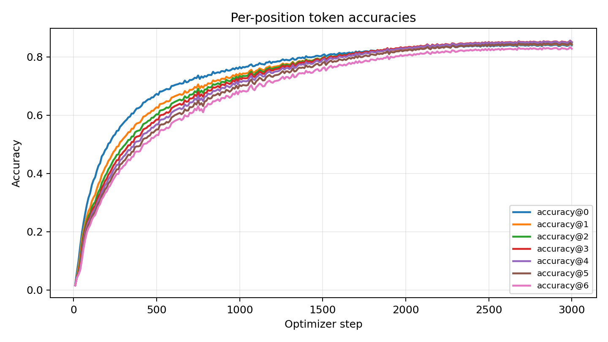
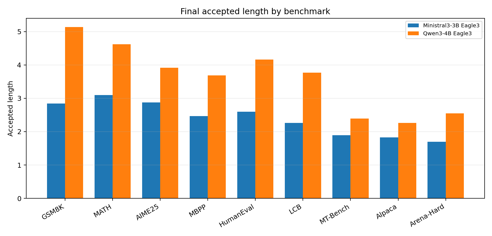

# Ministral3-3B Eagle3 DeepSpec Reproduction

This run integrated `mistralai/Ministral-3-3B-Instruct-2512` into the DeepSpec
Eagle3 training and evaluation stack and trained a TTT-7 Eagle3 draft for 3000
optimizer steps. The final result does not reproduce the Qwen3-4B Eagle3
accepted-length numbers reported by DeepSpec: the Ministral3-3B macro accepted
length is `2.40`, versus `3.61` for the Qwen3-4B Eagle3 table.

## Setup

| Field | Value |
| --- | --- |
| Target model | `mistralai/Ministral-3-3B-Instruct-2512` |
| Draft recipe | Eagle3, TTT length 7 |
| Target layers | `[1, 7, 13, 19, 24]` |
| Training data | 9,907 target-regenerated Open-PerfectBlend samples |
| Max sequence length | 4096 |
| Global batch size | 512 |
| Training steps | 3000 |
| Learning rate | `6e-4` |
| Warmup ratio | `0.04` |
| Grad clipping | `1.0` |
| Final checkpoint | `/mnt/vast/home/andy/checkpoints/deepspec/eagle3_ttt7_ministral3_3b_10k_3000steps/step_latest` |
| Final eval JSON | `/mnt/vast/runs/andy/deepspec_ministral3_3b_eagle3/eval_10k_step3000_metrics.json` |

## Training Curves

The training metrics reached high in-distribution accept-rate proxies by step
3000: `accept_rate@0..6 = 0.783, 0.780, 0.781, 0.779, 0.773, 0.762, 0.741`,
with `tau_greedy = 5.19` and `tau_probabilistic = 4.43`.

## Final Evaluation

| Dataset | Ministral3-3B Eagle3 accepted length | DeepSpec Qwen3-4B Eagle3 accepted length | Delta | Verify rate |
| --- | ---: | ---: | ---: | ---: |
| GSM8K | 2.84 | 5.14 | -2.30 | 0.357 |
| MATH500 | 3.10 | 4.62 | -1.52 | 0.388 |
| AIME25 | 2.88 | 3.92 | -1.04 | 0.360 |
| MBPP | 2.46 | 3.69 | -1.23 | 0.310 |
| HumanEval | 2.60 | 4.16 | -1.56 | 0.326 |
| LiveCodeBench | 2.27 | 3.77 | -1.50 | 0.283 |
| MT-Bench | 1.89 | 2.39 | -0.50 | 0.237 |
| Alpaca | 1.83 | 2.26 | -0.43 | 0.230 |
| Arena-Hard-v2 | 1.69 | 2.55 | -0.86 | 0.212 |
| **Macro mean** | **2.40** | **3.61** | **-1.22** | **0.300** |

## Conclusion

The implementation is functional and the training run converges on the
target-regenerated subset, but the final evaluation is well below the DeepSpec
Qwen3-4B Eagle3 reference. The train/eval gap is large: training accept-rate
metrics finish near `0.74-0.78`, while eval accepted length ranges from `1.69`
to `3.10`. The most likely next reproduction lever is data scale and
distribution, because this run used a 10k regenerated subset rather than the
full target-generated Open-PerfectBlend training corpus used for the published
DeepSpec checkpoints.
