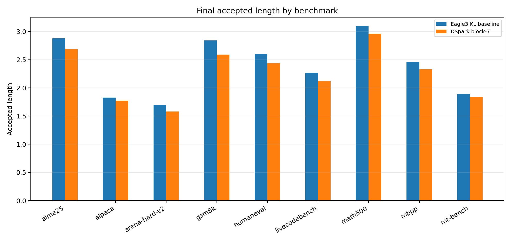
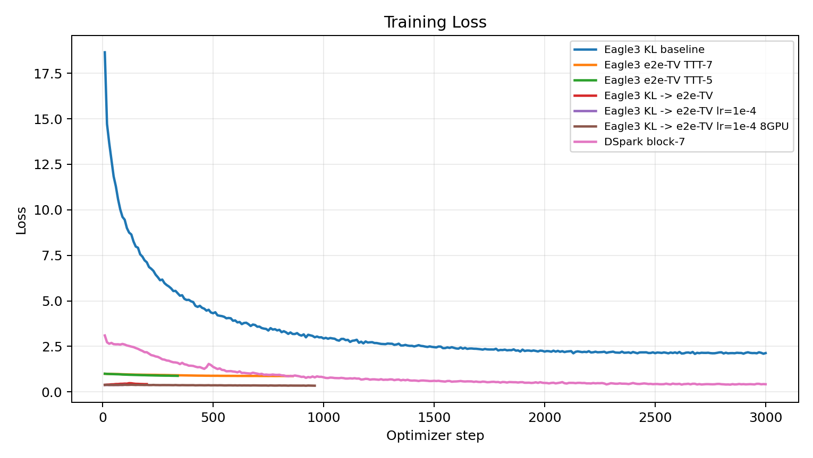
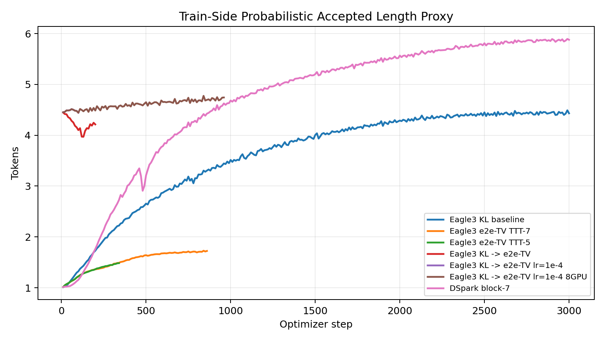
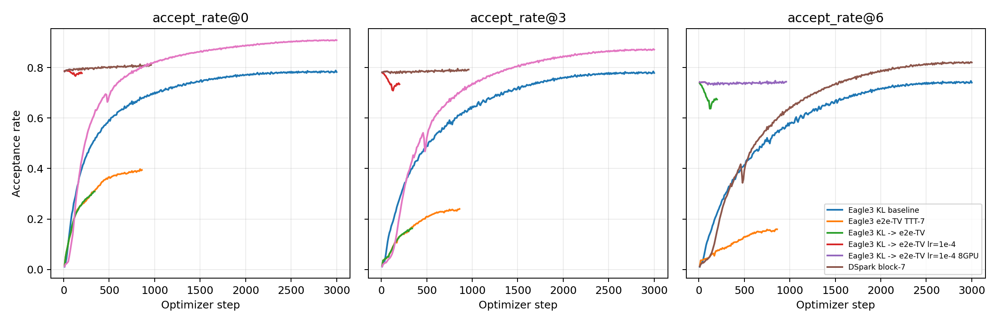

# Ministral3 Follow-Up Experiments

This follow-up tested whether the DeepSpec DSpark recipe transfers cleanly to
`mistralai/Ministral-3-3B-Instruct-2512`, and kept the Eagle3 KL baseline as the
main reference point.

## Final Status

The DSpark block-7 run reached `step_3000`, and the final eval artifact is now
complete with all nine benchmark rows:

- Checkpoint: `/mnt/vast/runs/andy/deepspec_checkpoints/deepspec/dspark_block7_ministral3_3b_8gpu/step_3000`
- Final eval JSON: `/mnt/vast/runs/andy/deepspec_ministral3_3b_followup/eval_dspark_8gpu_step3000_metrics.json`
- Preserved pre-merge 8/9 eval JSON: `/mnt/vast/runs/andy/deepspec_ministral3_3b_followup/eval_dspark_8gpu_step3000_metrics_partial_8of9.json`
- Arena-only rescue JSON: `/mnt/vast/runs/andy/deepspec_ministral3_3b_followup/eval_dspark_8gpu_step3000_arena_metrics.json`

The result does **not** reproduce the expected DSpark improvement over the
Eagle3 KL baseline on Ministral3-3B. DSpark finished with stronger train-side
acceptance proxies, but its final eval accepted length is lower than the KL
baseline on every benchmark.

## Final Eval

| Dataset | KL accepted length | DSpark accepted length | Delta | DSpark verify rate |
|---|---:|---:|---:|---:|
| gsm8k | 2.844 | 2.593 | -0.251 | 0.325 |
| math500 | 3.097 | 2.962 | -0.135 | 0.371 |
| aime25 | 2.877 | 2.688 | -0.189 | 0.336 |
| humaneval | 2.600 | 2.435 | -0.165 | 0.305 |
| mbpp | 2.464 | 2.331 | -0.133 | 0.292 |
| livecodebench | 2.265 | 2.120 | -0.146 | 0.265 |
| mt-bench | 1.890 | 1.841 | -0.049 | 0.230 |
| alpaca | 1.830 | 1.775 | -0.055 | 0.222 |
| arena-hard-v2 | 1.694 | 1.581 | -0.113 | 0.198 |
| **Macro avg** | **2.396** | **2.258** | **-0.137** | **0.283** |



## Training Metrics

The DSpark training run ended with strong train-side speculative proxies:

- `train/loss`: `0.4216`
- `train/tau_probabilistic`: `5.8782`
- `train/accept_rate@0`: `0.9089`
- `train/accept_rate@3`: `0.8717`
- `train/accept_rate@6`: `0.8207`

That train/eval gap is the main remaining discrepancy: the training accept-rate
metrics look healthy, but the official eval accepted lengths remain low.







The scalar snapshot used for these plots is in
[report_assets/train_metric_summary.json](report_assets/train_metric_summary.json).

## Reproduction Notes

All heavy artifacts were written under `/mnt/vast/runs/andy`. The final
`arena-hard-v2` row came from a one-dataset rescue eval because the first full
eval hit its 2h walltime after writing 8/9 rows. The rescue completed in
`00:40:44`, then `merge_eval_json.py` validated and merged the one-row arena
JSON into the final complete aggregate.

Useful commands:

```bash
sbatch experiments/ministral3_3b_followup/train_dspark_3000steps_8gpu.sbatch
sbatch experiments/ministral3_3b_followup/eval_dspark_8gpu_3000steps.sbatch
sbatch experiments/ministral3_3b_followup/eval_dspark_8gpu_arena_step3000.sbatch

.venv/bin/python experiments/ministral3_3b_followup/merge_eval_json.py \
  --base-json /mnt/vast/runs/andy/deepspec_ministral3_3b_followup/eval_dspark_8gpu_step3000_metrics.json \
  --extra-json /mnt/vast/runs/andy/deepspec_ministral3_3b_followup/eval_dspark_8gpu_step3000_arena_metrics.json \
  --output-json /mnt/vast/runs/andy/deepspec_ministral3_3b_followup/eval_dspark_8gpu_step3000_metrics_complete.json

.venv/bin/python experiments/ministral3_3b_followup/plot_followup_metrics.py
```
